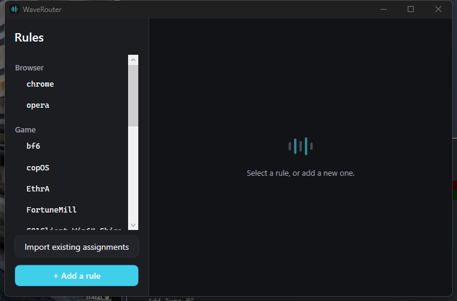

# WaveRouter

[](https://github.com/TheoDscps/wave-router/actions/workflows/build.yml)

A small Windows tray app that automatically routes a newly launched app's audio output to the
correct [Elgato Wave Link](https://www.elgato.com/wave-link) track, so you don't have to open Wave
Link and reassign the source by hand every time a game or app starts making noise.



## Download

Grab the latest `.zip` from the [Releases page](../../releases/latest), extract it anywhere, and
run `WaveRouter.exe`. It's self-contained, so no .NET install is required. Windows SmartScreen may
warn about the exe being unsigned (no code-signing certificate for this hobby project): click "More
info", then "Run anyway".

## How it works

WaveRouter watches for new Windows audio sessions in the background. When one starts and you've
already told it which Wave Link track that app belongs to, it routes it there automatically. The
first time it sees an app it doesn't know, it asks once and remembers the choice.

- **Rules**: simple `executable → Wave Link track` associations, managed from a small window
  (tray icon → "Open rules").
- **Automatic detection**: a background watcher picks up new audio sessions as they start.
- **Automatic routing**: matched sessions are routed via the same (undocumented) mechanism
  Windows itself uses for *Settings → System → Sound → App volume and device preferences*, with no
  admin rights needed.
- **Import**: existing app↔track assignments already made inside Wave Link, or directly in
  Windows, can be imported in one click instead of re-creating them by hand.
- **Live sync**: new assignments made inside Wave Link's own UI are picked up automatically.
- **Settings**: dark/light theme and French/English language, switched live, no restart needed.

See [`docs/use-cases/`](docs/use-cases/) for the detailed behavior of each feature and
[`ROADMAP.md`](ROADMAP.md) for what's done and what's next.

## Requirements

- Windows 10/11
- [Elgato Wave Link](https://www.elgato.com/wave-link) (for the virtual audio tracks to route to)
- The [.NET 10 SDK](https://dotnet.microsoft.com/download/dotnet/10.0), only if building from
  source; the packaged release above needs nothing extra.

## Building from source

```
git clone <this-repo>
cd WaveRouter
dotnet build WaveRouter.slnx
```

Run `src/WaveRouter/bin/Debug/net10.0-windows/WaveRouter.exe`, or `dotnet run --project src/WaveRouter`.

## Stack

.NET 10, WPF (hand-rolled MVVM, no third-party MVVM framework), NAudio for Core Audio session
detection, and direct P/Invoke into an undocumented WinRT-internal Windows API for per-application
audio routing, ported from [EarTrumpet](https://github.com/File-New-Project/EarTrumpet) (see
[Third-Party Notices](THIRD-PARTY-NOTICES.md)).

## Project structure

```
src/
  WaveRouter.Core/            # pure domain, zero Windows dependency
  WaveRouter.Infrastructure/  # NAudio, Windows/WinRT interop, JSON persistence
  WaveRouter/                 # WPF app, tray icon, composition root
```

## Status

Solo hobby project, built to solve a personal annoyance. No warranty, no support commitment:
issues and PRs are welcome, but there's no dedicated support channel. See
[CONTRIBUTING.md](CONTRIBUTING.md) for how to set up a dev environment and the PR workflow.

## License

[MIT](LICENSE). See also [Third-Party Notices](THIRD-PARTY-NOTICES.md) for the EarTrumpet-derived code.
